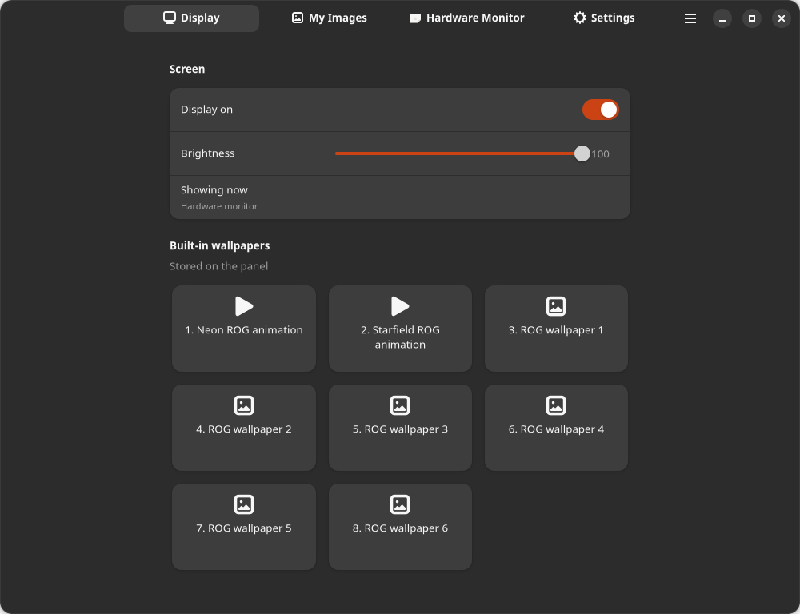
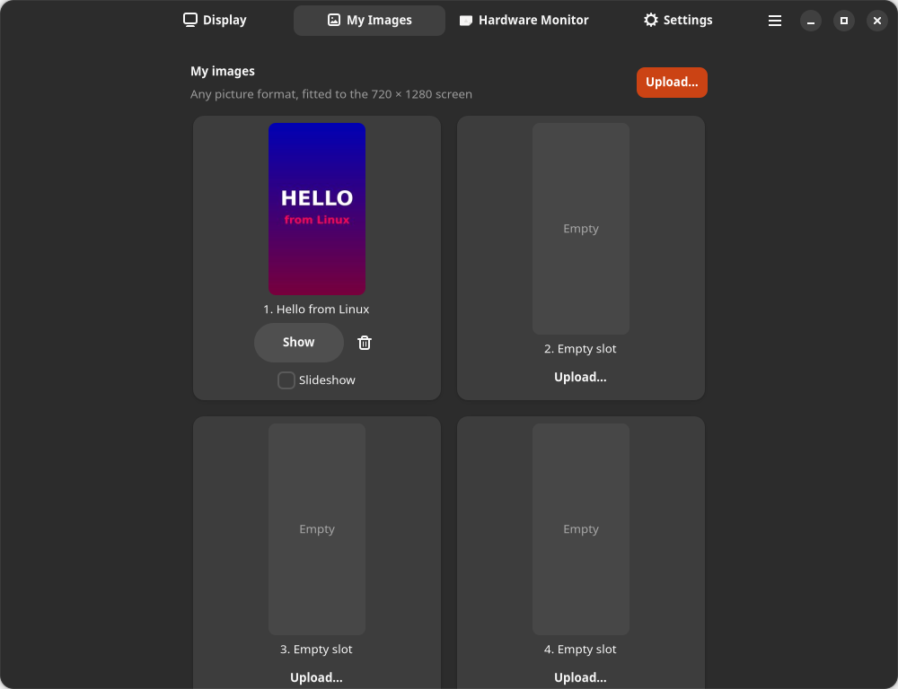
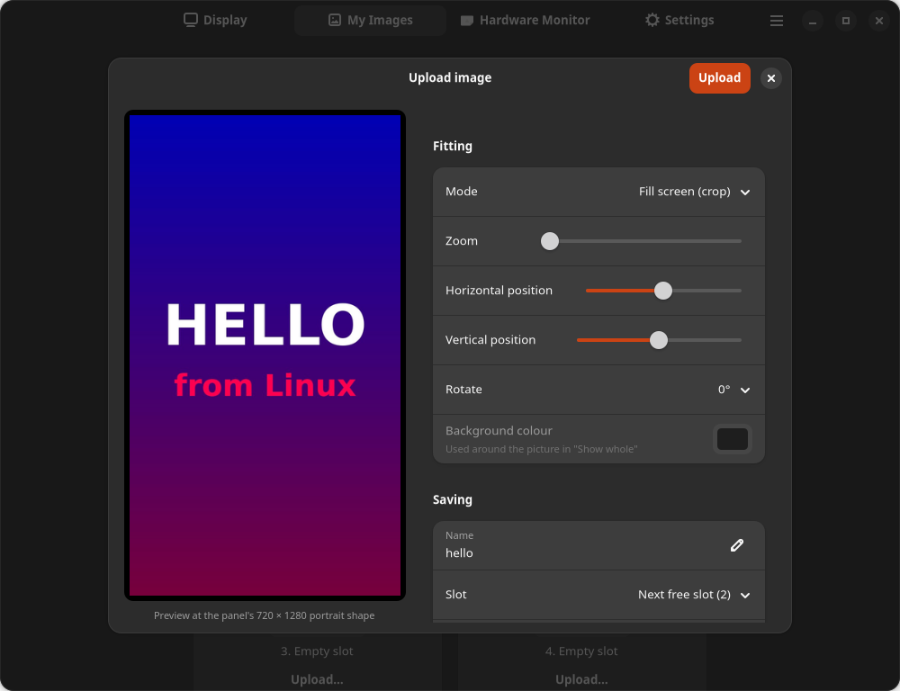
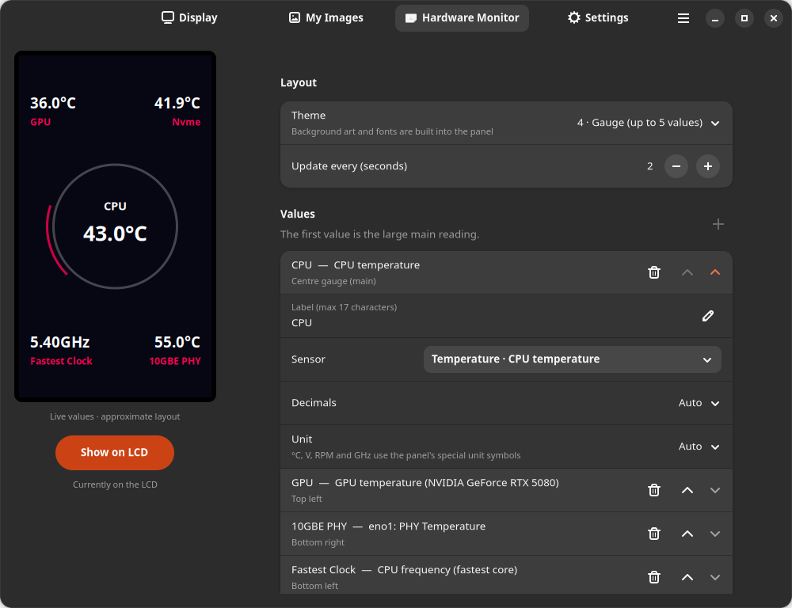
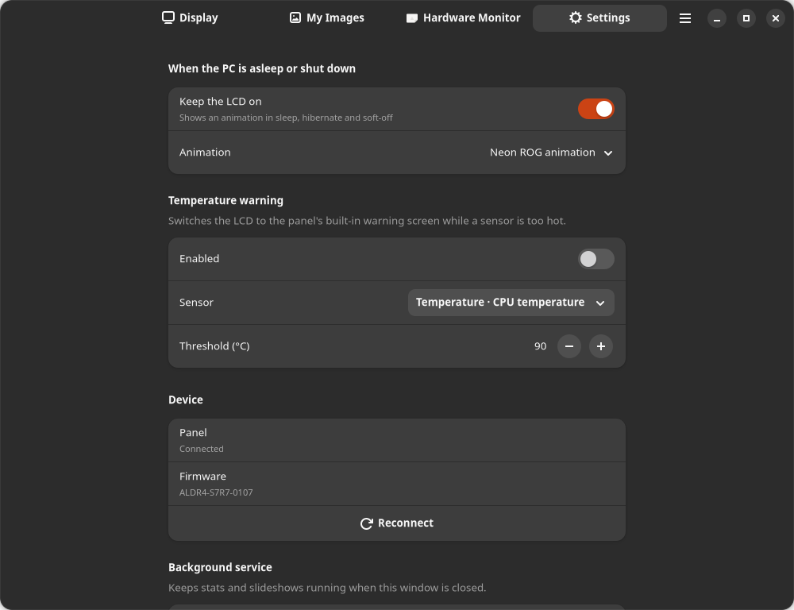
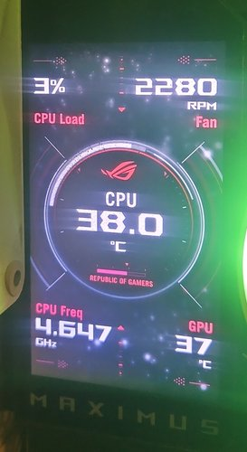
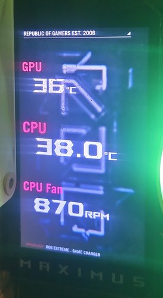
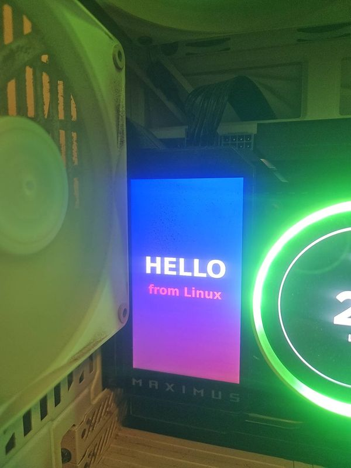
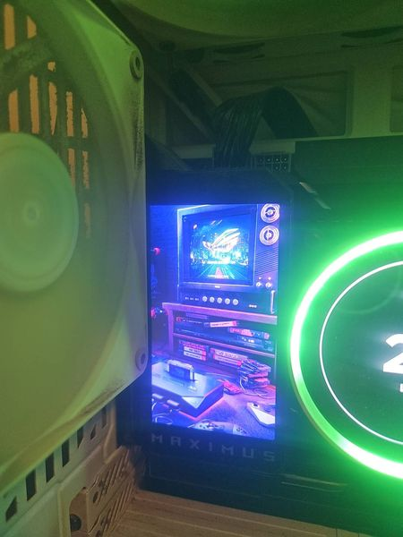
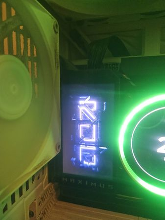

# Screenshots

## The app

### Display
Turn the panel on or off, set the brightness and pick one of the built-in wallpapers.

### My Images
Eight picture slots stored on the panel. Show, delete or add pictures to the slideshow.

### Uploading a picture
Any image format. Choose how it fills the 720 × 1280 portrait screen – crop with zoom and position,
show the whole picture on a background colour, or stretch – and see exactly what the panel will show.

### Hardware Monitor
Pick one of the panel's four themes, then choose up to five values. Each value gets its own label,
any Linux sensor, decimals and unit. The preview on the left shows where each value goes, with live
readings.

### Settings
What to show while the PC sleeps or is shut down, the temperature warning, device info and autostart.

## On the LCD

Phone photos of the panel in a ROG MAXIMUS Z890 EXTREME build.

| Gauge theme with five live values | Theme 1 with three values |
|---|---|
|  |  |

| A picture uploaded from Linux | Built-in wallpaper | Neon ROG animation |
|---|---|---|
|  |  |  |
